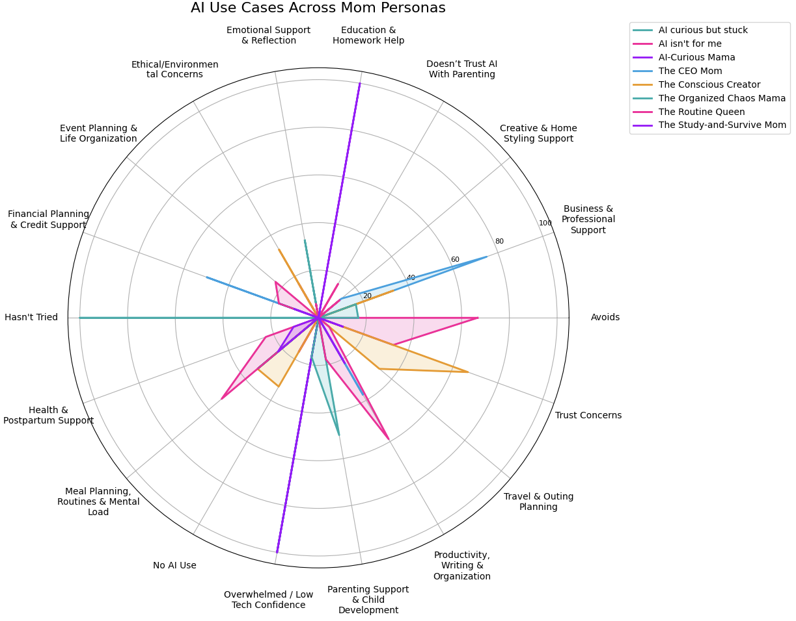
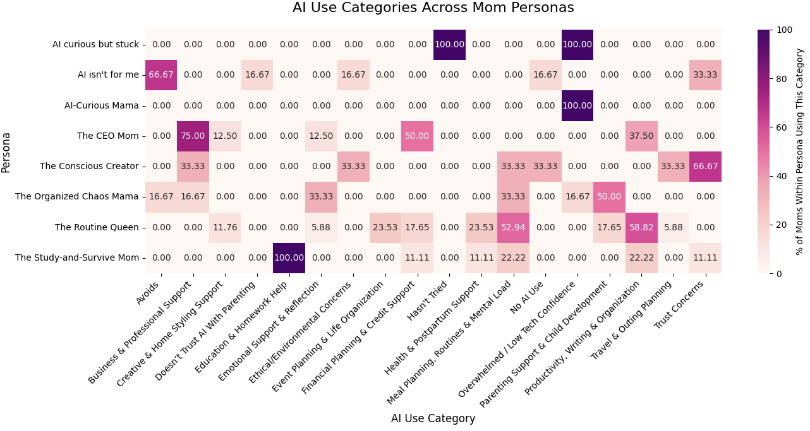

# How Moms Use AI
### Behavioral Segmentation, NLP & Persona Classification from Real User Feedback

---

## Project Overview

AI tools are everywhere, but not everyone is using them the same way, or at all. I wanted to understand how moms specifically are engaging with AI in their real lives: what they use it for, what stops them, and what patterns show up across different types of users.

I collected survey responses directly from 52 mothers and built an end-to-end machine learning pipeline to turn those raw, messy responses into something structured and useful. The result is a behavior-based persona framework backed by NLP, clustering, and a supervised classifier. Not just a summary of what people said, but a model that can predict who they are.

---

## Business Problem

A lot of AI products are built around what the technology can do, not around how real people actually use it. For moms managing work, kids, schedules, and everything in between, usefulness comes down to context, trust, and simplicity.

This project set out to answer:

- How are moms currently using AI tools?
- What's stopping the ones who aren't?
- Which behaviors define different types of users?
- Can we predict a mom's persona from her survey responses alone?

---

## Dataset

I collected real survey responses from 52 mothers covering their daily AI habits, attitudes, perceived benefits, concerns, and routines. The data was unstructured and inconsistent, which made it a realistic challenge and not a clean Kaggle dataset someone else prepared.

---

## Methodology

### 1. Data Cleaning
Converted yes/no responses to binary, handled missing values in open-text fields, and normalized inconsistent mom-type descriptions into structured categories.

### 2. Feature Engineering
This was the most involved part of the project. I built a custom multi-label keyword classifier to extract use-case categories from open-ended responses, things like Education & Homework Help, Meal Planning, and Financial Planning. I also applied TF-IDF vectorization to capture linguistic patterns the keyword classifier might miss. The two approaches work together rather than replacing each other. The keyword classifier provides interpretable labels for persona assignment, while TF-IDF surfaces distinctive language mathematically.

### 3. Clustering
Before running KMeans I applied StandardScaler because KMeans is distance-based, and unscaled features with larger magnitudes would unfairly dominate the calculation. I then tested k=2 through k=8 using an elbow curve and silhouette scores to choose the right number of clusters.

K=3 was selected because inertia drops sharply from k=2 to k=3 and then flattens out. Beyond k=3, each additional cluster yields diminishing returns and the added complexity isn't justified by the data. Silhouette scores remained below 0.20 across all tested values, which is expected with qualitative survey data. Human behavior exists on a spectrum, not in hard boundaries. This is why rule-based persona assignment was used as the primary framework rather than relying solely on KMeans. When clusters aren't well-separated, human-defined logic produces more interpretable and stable groupings.

### 4. Persona Assignment & Validation
I built an assign_persona() function that maps each mom's use-case combination to one of 8 named personas. To validate it, I compared the rule-based assignments against the unsupervised cluster results using a crosstab. Strong alignment confirmed the personas reflect real structure in the data, not just researcher assumptions.

### 5. Classification Model
I chose Random Forest for several reasons. First, with only 52 rows, a single decision tree would risk overfitting. Random Forest reduces that by averaging across 100 trees, each trained on a random subset of the data. More importantly, I'm predicting human behavior, which isn't linear. Multiple things can be true about a mom at once, and Random Forest handles that complexity naturally. Feature importance also gives a valuable business output. It shows which behaviors most define each persona and where to focus when building AI tools for moms.

The model was trained on a combined feature matrix of TF-IDF scores and scaled engineered features, with an 80/20 train/test split. It achieved 55% accuracy on held-out data, which is 4x better than the 12.5% random chance baseline for 8 classes. The biggest limitation was class imbalance. Underrepresented personas like AI-Curious Mama had too few training examples to learn from.

---

## Tools & Technologies

**Python • Pandas • NumPy • scikit-learn • TfidfVectorizer • KMeans • Random Forest • StandardScaler • MultiLabelBinarizer • Matplotlib • Seaborn • Jupyter Notebook**

---

## Model Performance

| Metric | Value |
|---|---|
| Overall Accuracy | 55% |
| Random Chance Baseline | 12.5% |
| Improvement Over Baseline | +42.5% |
| Strongest Persona | The Routine Queen (F1: 0.86) |
| Weakest Persona | AI-Curious Mama (F1: 0.00, class imbalance) |
| Test Set Size | 11 rows (20% of 52) |

---

## Key Findings

- 80% of surveyed moms use AI for a variety of purposes
- The most common use case was Education & Homework Help, including homework support, lesson planning, and breaking down complex concepts for their children
- Non-adopters are often overwhelmed by AI or have low confidence in AI tools, suggesting onboarding resources and simplified entry points could drive adoption
- The Routine Queen was the most common persona, suggesting moms are primarily drawn to AI as a tool for reducing mental load and managing daily structure

---

## Persona Framework

**The AI-Curious but Stuck.** Interested but unsure where to start. Needs low-friction onboarding and real examples.

**AI Isn't for Me.** Skeptical or disengaged. Doesn't currently see enough value to adopt.

**The AI-Curious Mama.** Occasional user whose confidence is growing through experimentation.

**The CEO Mom.** Uses AI strategically for planning, productivity, and decision-making.

**The Conscious Creator.** Selective user who weighs ethics, originality, and trust.

**The Organized Chaos Mama.** Uses AI to reduce mental load and manage household logistics.

**The Routine Queen.** Uses AI for structure, consistency, scheduling, and repeatable systems.

**The Study-and-Survive Mom.** Uses AI for school support, homework help, and time-saving tasks.

---

## Limitations

- 52 responses limits generalization. Findings are exploratory, not conclusive
- Class imbalance affected classifier performance on underrepresented personas
- Keyword classification introduces some subjectivity in category definitions
- Silhouette scores below 0.20 reflect soft cluster boundaries, consistent with behavioral data

---

## Next Steps

- Expand the dataset to address class imbalance and improve classifier performance
- Implement cross-validation for more reliable accuracy estimates beyond a single 80/20 split
- Add sentiment scoring to quantitatively validate manually coded attitude labels
- Explore sentence embeddings as a richer alternative to TF-IDF

---

---

## Author

**Kamri Williams**
Data Scientist | AI Enthusiast | Human-Centered Problem Solver

[Portfolio](https://kamriwilliams.wixsite.com/kamriwilliams) • [GitHub](https://github.com/kamriwilliams)
